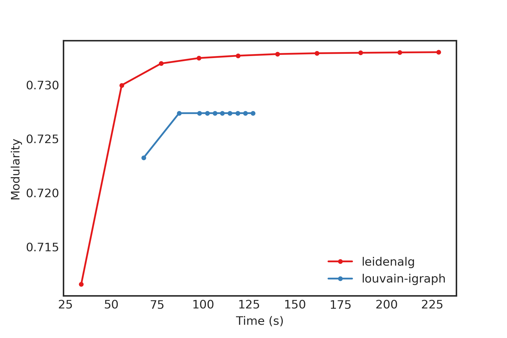
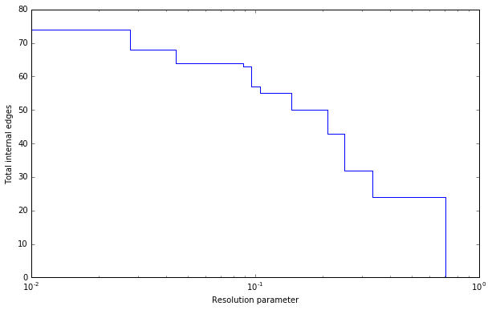

Advanced
========

The basic interface explained in the :ref:`Introduction` should provide you
enough to start detecting communities. However, perhaps you want to improve the
partitions further or want to do some more advanced analysis. In this section,
we will explain this in more detail.

Optimiser
---------

Although the package provides simple access to the function
:func:`~leidenalg.find_partition`, there is actually an underlying
:class:`~leidenalg.Optimiser` class that is doing the actual work. We can also
explicitly construct an :class:`~leidenalg.Optimiser` object:

>>> optimiser = la.Optimiser()

The function :func:`~leidenalg.find_partition` then does nothing else then
calling :func:`~leidenalg.Optimiser.optimise_partition` on the provided
partition.

.. testsetup::

   G = ig.Graph.Erdos_Renyi(100, p=5./100)
   partition = la.CPMVertexPartition(G)

>>> diff = optimiser.optimise_partition(partition)

:func:`~leidenalg.Optimiser.optimise_partition` simply tries to improve any
provided partition. We can thus try to repeatedly call
:func:`~leidenalg.Optimiser.optimise_partition` to keep on improving the current
partition:

>>> G = ig.Graph.Erdos_Renyi(100, p=5./100)
>>> partition = la.ModularityVertexPartition(G)
>>> diff = 1
>>> while diff > 0:
...   diff = optimiser.optimise_partition(partition)

Even if a call to :func:`~leidenalg.Optimiser.optimise_partition` did not improve
the current partition, it is still possible that a next call will improve the
partition. Of course, if the current partition is already optimal, this will
never happen, but it is not possible to decide whether a partition is optimal.

This functionality of repeating multiple iterations is actually already
built-in. You can simply call

>>> diff = optimiser.optimise_partition(partition, n_iterations=10)

If ``n_iterations < 0`` the optimiser continues iterating until it encounters
an iterations that did not improve the partition.

The :func:`~leidenalg.Optimiser.optimise_partition` itself is built on two other
basic algorithms: :func:`~leidenalg.Optimiser.move_nodes` and
:func:`~leidenalg.Optimiser.merge_nodes`. You can also call these functions
yourself. For example:

>>> diff = optimiser.move_nodes(partition)

or

>>> diff = optimiser.merge_nodes(partition)

The simpler Louvain algorithm aggregates the partition and repeats the
:func:`~leidenalg.Optimiser.move_nodes` on the aggregated partition. We can easily
emulate that:

>>> partition = la.ModularityVertexPartition(G)
>>> while optimiser.move_nodes(partition) > 0:
...   partition = partition.aggregate_partition()

This summarises the whole Louvain algorithm in just three lines of code.
Although this finds the final aggregate partition, it leaves unclear the actual
partition on the level of the individual nodes. In order to do that, we need to
update the membership based on the aggregate partition, for which we use the
function
:func:`~leidenalg.VertexPartition.MutableVertexPartition.from_coarse_partition`.

>>> partition = la.ModularityVertexPartition(G)
>>> partition_agg = partition.aggregate_partition()
>>> while optimiser.move_nodes(partition_agg) > 0:
...   partition.from_coarse_partition(partition_agg)
...   partition_agg = partition_agg.aggregate_partition()

Now ``partition_agg`` contains the aggregate partition and ``partition``
contains the actual partition of the original graph ``G``. Of course,
``partition_agg.quality() == partition.quality()`` (save some rounding).

Instead of :func:`~leidenalg.Optimiser.move_nodes`, you could also use
:func:`~leidenalg.Optimiser.merge_nodes`. These functions depend on choosing
particular alternative communities: the documentation of the functions provides
more detail.

One possibility is that rather than aggregating the partition based on the
current partition, you can first refine the partition and then aggregate it.
This is what is done in the Leiden algorithm, and can be done using the functions
:func:`~leidenalg.Optimiser.move_nodes_constrained` and
:func:`~leidenalg.Optimiser.merge_nodes_constrained`. Implementing this, you
end up with the following high-level implementation of the Leiden algorithm:

>>> # Set initial partition
>>> partition = la.ModularityVertexPartition(G)
>>> refined_partition = la.ModularityVertexPartition(G)
>>> partition_agg = refined_partition.aggregate_partition()
>>>
>>> while optimiser.move_nodes(partition_agg):
...
...   # Get individual membership for partition
...   partition.from_coarse_partition(partition_agg, refined_partition.membership)
...
...   # Refine partition
...   refined_partition = la.ModularityVertexPartition(G)
...   optimiser.merge_nodes_constrained(refined_partition, partition)
...
...   # Define aggregate partition on refined partition
...   partition_agg = refined_partition.aggregate_partition()
...
...   # But use membership of actual partition
...   aggregate_membership = [None] * len(refined_partition)
...   for i in range(G.vcount()):
...     aggregate_membership[refined_partition.membership[i]] = partition.membership[i]
...   partition_agg.set_membership(aggregate_membership)

These functions in turn rely on two key functions of the partition:
:func:`~leidenalg.VertexPartition.MutableVertexPartition.diff_move` and
:func:`~leidenalg.VertexPartition.MutableVertexPartition.move_node`. The first
calculates the difference when moving a node, and the latter actually moves the
node, and updates all necessary internal administration. The
:func:`~leidenalg.Optimiser.move_nodes` then does something as follows

>>> for v in G.vs:
...   best_comm = max(range(len(partition)),
...                   key=lambda c: partition.diff_move(v.index, c))
...   partition.move_node(v.index, best_comm)

The actual implementation is more complicated, but this gives the general idea.

This package builds on a previous implementation of the Louvain algorithm in
`louvain-igraph <https://github.com/vtraag/louvain-igraph>`_.  To illustrate
the difference between ``louvain-igraph`` and ``leidenalg``, we ran both
algorithms for 10 iterations on a `Youtube network
<https://snap.stanford.edu/data/com-Youtube.html>`_ of more than 1 million
nodes and almost 3 million edges.

The results are quite clear: Leiden is able to achieve a higher modularity in
less time. It also points out that it is usually a good idea to run Leiden for
at least two iterations; this is also the default setting.

Note that even if the Leiden algorithm did not find any improvement in this
iteration, it is always possible that it will find some improvement in the next
iteration.

Resolution profile
------------------

Some methods accept so-called resolution parameters, such as
:class:`~leidenalg.CPMVertexPartition` or
:class:`~leidenalg.RBConfigurationVertexPartition`. Although some methods may seem
to have some 'natural' resolution, in reality this is often quite arbitrary.
However, the methods implemented here (which depend in a linear way on
resolution parameters) allow for an effective scanning of a full range for the
resolution parameter. In particular, these methods somehow can be formulated as
:math:`Q = E - \gamma N` where :math:`E` and :math:`N` are some other
quantities. In the case for :class:`~leidenalg.CPMVertexPartition` for example,
:math:`E = \sum_c m_c` is the number of internal edges and :math:`N = \sum_c
\binom{n_c}{2}` is the sum of the internal possible edges. The essential
insight for these formulations [1]_ is that if there is an optimal partition
for both :math:`\gamma_1` and :math:`\gamma_2` then the partition is also
optimal for all :math:`\gamma_1 \leq \gamma \leq \gamma_2`.

Such a resolution profile can be constructed using the
:class:`~leidenalg.Optimiser` object.

>>> G = ig.Graph.Famous('Zachary')
>>> optimiser = la.Optimiser()
>>> profile = optimiser.resolution_profile(G, la.CPMVertexPartition,
...                                        resolution_range=(0,1))

Plotting the resolution parameter versus the total number of internal edges we
thus obtain something as follows:

Now ``profile`` contains a list of partitions of the specified type
(:class:`~leidenalg.CPMVertexPartition` in this case) for
resolution parameters at which there was a change. In particular,
``profile[i]`` should be better until ``profile[i+1]``, or stated otherwise for
any resolution parameter between ``profile[i].resolution_parameter`` and
``profile[i+1].resolution_parameter`` the partition at position ``i`` should be
better. Of course, there will be some variations because
:func:`~leidenalg.Optimiser.optimise_partition` will find partitions of varying
quality. The change points can then also vary for different runs.

This function repeatedly calls :func:`~leidenalg.Optimiser.optimise_partition`
and can therefore require a lot of time. Especially for resolution parameters
right around a change point there may be many possible partitions, thus
requiring a lot of runs.

Fixed nodes
-----------

For some purposes, it might be beneficial to only update part of a partition.
For example, perhaps we previously already ran the Leiden algorithm on some
dataset, and did some analysis on the resulting partition. If we then gather new
data, and in particular new nodes, it might be useful to keep the previous
community assignments fixed, while only updating the community assignments for
the new nodes. This can be done using the ``is_membership_fixed`` argument of
:func:`~leidenalg.Optimiser.find_partition`, see [2]_ for some details.

For example, suppose we previously detected ``partition`` for graph ``G``, which
was extended to graph ``G2``. Assuming that the previously exiting nodes are
identical, we could create a new partition by doing

>>> new_membership = list(range(G2.vcount()))
... new_membership[:G.vcount()] = partition.membership

We can then only update the community assignments for the new nodes as follows

>>> new_partition = la.CPMVertexPartition(G2, new_membership,
...                                       resolution_parameter=partition.resolution_parameter)
... is_membership_fixed = [i < G.vcount() for i in range(G2.vcount())]
>>> diff = optimiser.optimise_partition(partition, is_membership_fixed=is_membership_fixed)

In this example we used :class:`~leidenalg.CPMVertexPartition`. but any other
``VertexPartition`` would work as well.

Maximum community size
----------------------

In some cases, you may want to restrict the community sizes. It is possible to indicate this
by setting the :attr:`~leidenalg.Optimiser.max_comm_size` parameter so that this constraint is
taken into account during optimisation. In addition, it is possible to pass this parameter
directly when using :func:`~leidenalg.find_partition`. For example

>>> partition = la.find_partition(G, la.ModularityVertexPartition, max_comm_size=10)

References
----------
.. [1] Traag, V. A., Krings, G., & Van Dooren, P. (2013). Significant scales in
       community structure. Scientific Reports, 3, 2930.  `10.1038/srep02930
       <http://doi.org/10.1038/srep02930>`_

.. [2] Zanini, F., Berghuis, B. A., Jones, R. C., Robilant, B. N. di,
       Nong, R. Y., Norton, J., Clarke, Michael F., Quake, S. R. (2019).
       northstar: leveraging cell atlases to identify healthy and neoplastic
       cells in transcriptomes from human tumors. BioRxiv, 820928.
       `10.1101/820928 <https://doi.org/10.1101/820928>`_
