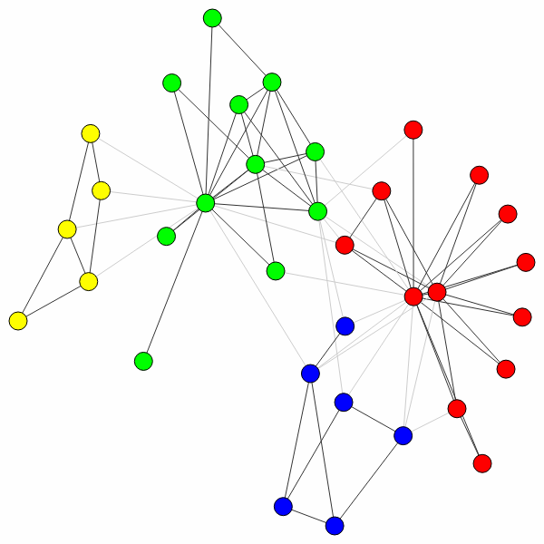
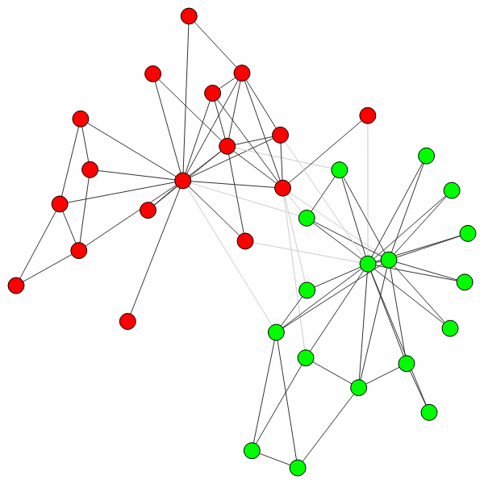

Introduction
============

The :mod:`leidenalg` package facilitates community detection of networks and
builds on the package :mod:`igraph`. We abbreviate the :mod:`leidenalg` package as
``la`` and the ``igraph`` package as ``ig`` in all ``Python`` code throughout
this documentation. Although the options in the :mod:`leidenalg` community
detection package are extensive, most people are presumably simply interested
in detecting communities with a robust method that works well. This
introduction explains how to do that.

For those without patience (and some prior experience), if you simply want to
detect communities given a graph ``G`` using modularity, you simply use

.. testsetup::
   
   G = ig.Graph.Erdos_Renyi(100, p=5./100); 

>>> partition = la.find_partition(G, la.ModularityVertexPartition);

That's it.

Why then should you use this package rather than for example the Louvain
algorithm :func:`community_multilevel` built into :mod:`igraph`? If you want to
use modularity, and you work with a simple undirected, unweighted graph, then
indeed you may use the built-in method. For anything else, the functionality is
not built-in and this package is for you. Moreover, the Leiden algorithm is
typically faster than the Louvain algorithm and returns partitions of a higher
quality.

For those less familiar with :mod:`igraph`, let us work out an example more
fully. First, we need to import the relevant packages:

>>> import igraph as ig
>>> import leidenalg as la

Let us then look at one of the most famous examples of network science: the
Zachary karate club (it even has a prize named after it):

>>> G = ig.Graph.Famous('Zachary')

Now detecting communities with modularity is straightforward, as demonstrated
earlier: 

>>> partition = la.find_partition(G, la.ModularityVertexPartition)

You can simply plot the results as follows:

>>> ig.plot(partition) # doctest: +SKIP

In this case, the algorithm actually finds the optimal partition (for small
graphs like these you can check this using
:func:`~ig.Graph.community_optimal_modularity` in the :mod:`igraph` package),
but this is generally not the case (although the algorithm should do well).
Although this is the optimal partition, it does not correspond to the split in
two factions that was observed for this particular network. We can uncover that
split in two using a different method, :class:`~leidenalg.CPMVertexPartition`:

>>> partition = la.find_partition(G, la.CPMVertexPartition,
...                                    resolution_parameter = 0.05);
>>> ig.plot(partition) # doctest: +SKIP

Note that any additional ``**kwargs`` passed to :func:`~leidenalg.find_partition`
is passed on to the constructor of the given ``partition_type``. In this case,
we can pass the ``resolution_parameter``, but we could also pass ``weights`` or
``node_sizes``.

This is the real benefit of using this package: it provides implementations for
six different methods (see :ref:`Reference`), and works also on directed and
weighted graphs. In addition, it also provides flexible functionality for
customizing to some extent the optimisation routines (see :ref:`Advanced`).
Finally, it also allows to work with more complex multiplex graphs (see
:ref:`Multiplex`).

The Leiden algorithm [1] extends the Louvain algorithm [2], which is widely
seen as one of the best algorithms for detecting communities. However, the
Louvain algorithm can lead to arbitrarily badly connected communities, whereas
the Leiden algorithm guarantees communities are well-connected. In fact, it
converges towards a partition in which all subsets of all communities are
locally optimally assigned. Finally, the Leiden algorithm is also much faster,
because it relies on a fast local move routine. The 
`"canonical" <https://github.com/CWTSLeiden/networkanalysis>`_
Leiden algorithm is implemented
in ``Java`` and is faster than this implementation, but less extensive.

References
----------

.. [1] Traag, V.A., Waltman. L., Van Eck, N.-J. (2018). From Louvain to
       Leiden: guaranteeing well-connected communities.
       `arXiv:1810.08473 <https://arxiv.org/abs/1810.08473>`_

.. [2] Blondel, V. D., Guillaume, J.-L., Lambiotte, R., & Lefebvre, E.
       (2008). Fast unfolding of communities in large networks. Journal of
       Statistical Mechanics: Theory and Experiment, 10008(10), 6.
       `10.1088/1742-5468/2008/10/P10008 <https://doi.org/10.1088/1742-5468/2008/10/P10008>`_

