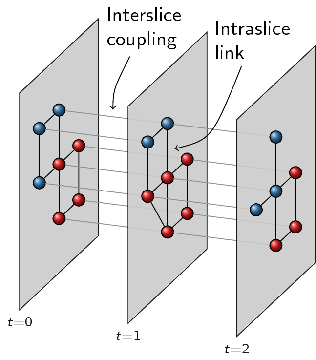
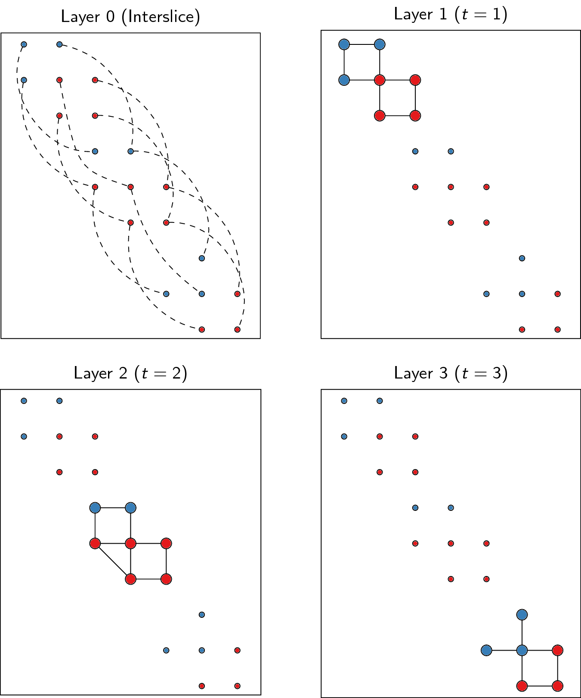

Multiplex
=========

The implementation of multiplex community detection builds on ideas in [1]_.
The most basic form simply considers two or more graphs which are defined on
the same vertex set, but which have differing edge sets. In this context, each
node is identified with a single community, and cannot have different
communities for different graphs. We call this *layers* of graphs in this
context. This format is actually more flexible than it looks, but you have to
construct the layer graphs in a smart way. Instead of having layers of graphs
which are always identified on the same vertex set, you could define *slices*
of graphs which do not necessarily have the same vertex set. Using slices we
would like to assign a node to a community for each slice, so that the
community for a node can be different for different slices, rather than always
being the same for all layers. We can translate *slices* into *layers* but it
is not an easy transformation to grasp fully. But by doing so, we can again
rely on the same machinery we developed for dealing with layers.

Throughout the remained of this section, we assume an optimiser has been
created:

>>> optimiser = la.Optimiser()

Layer multiplex
---------------

If we have two graphs which are identified on exactly the same vertex set, we
say we have two *layers*. For example, suppose graph ``G_telephone`` contains
the communication between friends over the telephone and that the graph
``G_email`` contains the communication between friends via mail. The exact same
vertex set then means that ``G_telephone.vs[i]`` is identical to the node
``G_email.vs[i]``. For each layer we can separately specify the type of
partition that we look for. In principle they could be different for each
layer, but for now we will assume the type of partition is the same for all
layers.  The quality of all partitions combined is simply the sum of the
individual qualities for the various partitions, weighted by the
``layer_weight``. If we denote by :math:`q_k` the quality of layer :math:`k`
and the weight by :math:`w_k`, the overall quality is then

.. math:: q = \sum_k w_k q_k.

The optimisation algorithm is no different from the standard algorithm. We
simply calculate the overall difference of moving a node to another community
as the sum of the individual differences in all partitions. The rest
(aggregating and repeating on the aggregate partition) simple proceeds as
usual.

The most straightforward way to use this is then to use
:func:`~leidenalg.find_partition_multiplex`:

.. testsetup::

   G_telephone = ig.Graph.Erdos_Renyi(100, 0.1);
   G_email = ig.Graph.Erdos_Renyi(100, 0.1);

>>> membership, improv = la.find_partition_multiplex(
...                        [G_telephone, G_email],
...                        la.ModularityVertexPartition);

.. note:: You may need to carefully reflect how you want to weigh the importance
  of an individual layer. Since the :class:`~leidenalg.ModularityVertexPartition`
  is normalised by the number of links, you essentially weigh layers the same,
  independent of the number of links. This may be undesirable, in which case it
  may be better to use :class:`RBConfigurationVertexPartition`, which is
  unnormalised. Alternatively, you may specify different ``layer_weights``.

Similar to the simpler function :func:`~leidenalg.find_partition`, it is a simple
helper function. The function returns a membership vector, because the
membership for all layers is identical. You can also control the partitions and
optimisation in more detail. Perhaps it is better to use
:class:`~leidenalg.CPMVertexPartition` with different resolution parameter for
example for different layers of the graph.  For example, using email creates a
more connected structure because multiple people can be involved in a single
mail, which may require a higher resolution parameter for the email graph.

>>> part_telephone = la.CPMVertexPartition(
...                    G_telephone, resolution_parameter=0.01);
>>> part_email = la.CPMVertexPartition(
...                    G_email, resolution_parameter=0.3);
>>> diff = optimiser.optimise_partition_multiplex(
...                    [part_telephone, part_email]);

Note that ``part_telephone`` and ``part_email`` contain exactly the same
partition, in the sense that ``part_telephone.membership ==
part_email.membership``. The underlying graph is of course different, and hence
the individual quality will also be different.

Some layers may have a more important role in the partition and this can be
indicated by the ``layer_weight``. Using half the weight for the email layer for
example would be possible as follows:

>>> diff = optimiser.optimise_partition_multiplex(
...   [part_telephone, part_email],
...   layer_weights=[1,0.5]);

Negative links
^^^^^^^^^^^^^^

The layer weights are especially useful when negative links are present,
representing for example conflict or animosity. Most methods (except CPM) only
accept positive weights. In order to deal with graphs that do have negative
links, a solution is to separate the graph into two layers: one layer with
positive links, the other with only negative links [2]_. In general, we would
like to have relatively many positive links within communities, while for
negative links the opposite holds: we want many negative links between
communities. We can easily do this within the multiplex layer framework by
passing in a negative layer weight. For example, suppose we have a graph ``G``
with possibly negative weights. We can then separate it into a positive and
negative graph as follows:

.. testsetup::

   import numpy as np
   G = ig.Graph.Erdos_Renyi(100, 0.1)
   G.es['weight'] = np.random.randn(G.ecount());

>>> G_pos = G.subgraph_edges(G.es.select(weight_gt = 0), delete_vertices=False);
>>> G_neg = G.subgraph_edges(G.es.select(weight_lt = 0), delete_vertices=False);
>>> G_neg.es['weight'] = [-w for w in G_neg.es['weight']];

We can then simply detect communities using;

>>> part_pos = la.ModularityVertexPartition(G_pos, weights='weight');
>>> part_neg = la.ModularityVertexPartition(G_neg, weights='weight');
>>> diff = optimiser.optimise_partition_multiplex(
...   [part_pos, part_neg],
...   layer_weights=[1,-1]);

Bipartite
^^^^^^^^^

For some methods it may be possible to to community detection in bipartite
networks. Bipartite networks are special in the sense that they have only links
between the two different classes, and no links within a class are allowed. For
example, there might be products and customers, and there is a link between
:math:`i` and :math:`j` if a product :math:`i` is bought by a customer
:math:`j`. In this case, there are no links among products, nor among
customers. One possible approach is simply project this bipartite network into
the one or the other class and then detect communities. But then the
correspondence between the communities in the two different projections is
lost. Detecting communities in the bipartite network can therefore be useful.

Setting this up requires a bit of a creative approach, which is why it is also
explicitly explained here. We will explain it for the CPM method, and then show
how this works the same for some related measures. In the case of CPM you would
like to be able to set three different resolution parameters: one for within
each class :math:`\gamma_0, \gamma_1`, and one for the links between classes,
:math:`\gamma_{01}`. Then the formulation would be

.. math:: Q = \sum_{ij}
   [A_{ij}
    - (\gamma_0\delta(s_i,0) + \gamma_1\delta(s_i,1)) \delta(s_i,s_j)
    - \gamma_{01}(1 - \delta(s_i, s_j))
   ]\delta(\sigma_i, \sigma_j)

where :math:`s_i` denotes the bipartite class of a node and :math:`\sigma_i`
the community of the node as elsewhere in the documentation. Rewriting as a sum
over communities gives a bit more insight

.. math:: Q = \sum_c (e_c
                      - \gamma_{01} 2 n_c(0) n_c(1)
                      - \gamma_0 n^2_c(0)
                      - \gamma_1 n^2_c(1))

where :math:`n_c(0)` is the number of nodes in community :math:`c` of class 0
(and similarly for 1) and :math:`e_c` is the number of edges within community
:math:`c`. We denote by :math:`n_c = n_c(0) + n_c(1)` the total number of nodes
in community :math:`c`. Note that

.. math:: n_c^2 &= (n_c(0) + n_c(1))^2 \\
                &= n_c(0)^2 + 2 n_c(0) n_c(1) + n_c(1)^2

We then create three different layers: (1) all nodes have ``node_size = 1`` and
all relevant links; (2) only nodes of class 0 have ``node_size = 1`` and no
links; (3) only nodes of class 1 have ``node_size = 1`` and no links. If we add
the first with resolution parameter :math:`\gamma_{01}`, and the others with
resolution parameters :math:`\gamma_{01} - \gamma_0` and :math:`\gamma_{01}
- \gamma_1`, but the latter two with a layer weight of -1 while the first
layer has layer weight 1, we obtain the following:

.. math:: Q &=  \sum_c (e_c - \gamma_{01} n_c^2)
               -\sum_c (- (\gamma_{01} - \gamma_0) n_c(0)^2)
               -\sum_c (- (\gamma_{01} - \gamma_1) n_c(0)^2) \\
            &=  \sum_c [e_c - \gamma_{01} 2 n_c(0) n_c(1)
                            - \gamma_{01} n_c(0)^2
                            - \gamma_{01} n_c(1)^2)
                            + ( \gamma_{01} - \gamma_0) n_c(0)^2
                            + ( \gamma_{01} - \gamma_1) n_c(1)^2
                      ] \\
            &=  \sum_c (e_c - \gamma_{01} 2 n_c(0) n_c(1)
                          - \gamma_{0} n_c(0)^2
                          - \gamma_{1} n_c(1)^2) \\

Hence detecting communities with these three layers corresponds to detecting
communities in bipartite networks. Although we worked out this example for
directed network including self-loops (since it is easiest), it works out
similarly for undirected networks (with or without self-loops). This only
corresponds to the CPM method. However, using a little additional trick, we can
also make this work for modularity. Essentially, modularity is nothing else
than CPM with the ``node_size`` set to the degree, and the resolution parameter
set to :math:`\gamma = \frac{1}{2m}`. In particular, in general (i.e. not
specifically for bipartite graph) if ``node_sizes=G.degree()`` we then obtain

.. math:: Q = \sum_{ij} A_{ij} - \gamma k_i k_j

In the case of bipartite graphs something similar is obtained, but then
correctly adapted (as long as the resolution parameter is also appropriately
rescaled). Note that this is only possible for modularity for undirected
graphs. Hence, we can also detect communities in bipartite networks using
modularity by using this little trick. The definition of modularity for
bipartite graphs is identical to the formulation of bipartite modularity
provided in [3]_.

All of this has been implemented in the constructor
:func:`~leidenalg.CPMVertexPartition.Bipartite`. You can simply pass in a
bipartite network with the classes appropriately defined in ``G.vs['type']`` or
equivalent. This function assumes the two classes are coded by ``0`` and ``1``,
and if this is not the case it will try to convert it into such categories by
:func:`ig.UniqueIdGenerator`.

An explicit example of this:

.. testsetup::

   import numpy as np
   G.vs['type'] = np.random.randint(0, 2, G.vcount())

>>> p_01, p_0, p_1 = la.CPMVertexPartition.Bipartite(G,
...                    resolution_parameter_01=0.1);
>>> diff = optimiser.optimise_partition_multiplex([p_01, p_0, p_1],
...                                        layer_weights=[1, -1, -1]);

Slices to layers
----------------

The multiplex formulation as layers has two limitations: (1) each graph needs to
have an identical vertex set; (2) each node is only in a single community.
Ideally, one would like to relax both these requirements, so that you can work
with graphs that do not need to have identical nodes and where nodes can be in
different communities in different layers. For example, a person could be in one
community when looking at his professional relations, but in another community
looking at his personal relations. Perhaps more commonly: a person could be in
one community at time 1 and in another community at time 2.

Fortunately, this is also possible with this package. We call the more general
formulation *slices* in contrast to the *layers* required by the earlier
functions. Slices are then just different graphs, which do not need to have the
same vertex set in any way. The idea is to build one big graph out of all the
slices and then decompose it again in layers that correspond with slices. The
key element is that some slices are coupled: for example two consecutive time
windows, or simply two different slices of types of relations. Because any two
slices can be coupled in theory, we represent the coupling itself again with a
graph. The nodes of this *coupling graph* thus are slices, and the (possibly
weighted) links in the coupling graph represent the (possibly weighted)
couplings between slices. Below an example with three different time slices,
where slice 1 is coupled to slice 2, which in turn is coupled to slice 3:

The coupling graph thus consists of three nodes and a simple line structure: ``1
-- 2 -- 3``. We convert this into layers by putting all nodes of all slices in
one big network. Each node is thus represented by a tuple ``(node, slice)`` in a
certain sense. Out of this big network, we then only take those edges that are
defined between nodes of the same slice, which then constitutes a single layer.
Finally, we need one more layer for the couplings. In addition, for methods such
as :class:`~leidenalg.CPMVertexPartition`, so-called ``node_sizes`` are required, and for
them to properly function, they should be set to 0 (which is handled
appropriately by the package). We thus obtain equally many layers as we have
slices, and we need one more layer for representing the interslice couplings.
For the example provided above, we thus obtain the following:

To transform slices into layers using a coupling graph, this package provides
:func:`~leidenalg.layers_to_slices`. For the example above, this would function
as follows.  First create the coupling graph assuming we have three slices
``G_1``, ``G_2`` and ``G_3``:

.. testsetup::

   G_1 = ig.Graph.Erdos_Renyi(100, 0.1)
   G_2 = ig.Graph.Erdos_Renyi(100, 0.1)
   G_3 = ig.Graph.Erdos_Renyi(100, 0.1)

   G_1.vs['id'] = range(100)
   G_2.vs['id'] = range(100)
   G_3.vs['id'] = range(100)

>>> G_coupling = ig.Graph.Formula('1 -- 2 -- 3');
>>> G_coupling.es['weight'] = 0.1; # Interslice coupling strength
>>> G_coupling.vs['slice'] = [G_1, G_2, G_3]

Then we convert them to layers

>>> layers, interslice_layer, G_full = la.slices_to_layers(G_coupling);

Now we still have to create partitions for all the layers. We can freely choose
here to use the same partition types for all partitions, or to use different
types for different layers.

.. warning:: The interslice layer should usually be of type
  :class:`~leidenalg.CPMVertexPartition` with a ``resolution_parameter=0`` and
  ``node_sizes`` set to 0. The ``G.vs[node_size]`` is automatically set to 0
  for all nodes in the interslice layer in :func:`~leidenalg.slices_to_layers`,
  so you can simply pass in the attribute ``node_size``. Unless you know what
  you are doing, simply use these settings.

.. warning:: When using methods that accept a node_size argument, this should
  always be used. This is the case for :class:`~leidenalg.CPMVertexPartition`,
  :class:`~leidenalg.RBERVertexPartition`, :class:`~leidenalg.SurpriseVertexPartition` and
  :class:`~leidenalg.SignificanceVertexPartition`.

.. testsetup::

   gamma = 0.5;

>>> partitions = [la.CPMVertexPartition(H, node_sizes='node_size',
...                                          weights='weight', resolution_parameter=gamma)
...               for H in layers];
>>> interslice_partition = la.CPMVertexPartition(interslice_layer, resolution_parameter=0,
...                                                   node_sizes='node_size', weights='weight');

You can then simply optimise these partitions as before using
:func:`~leidenalg.Optimiser.optimise_partition_multiplex`:

>>> diff = optimiser.optimise_partition_multiplex(partitions + [interslice_partition]);

Temporal community detection
----------------------------

One of the most common tasks for converting slices to layers is that we have
slices at different points in time. We call this temporal community detection.
Because it is such a common task, we provide several helper functions to
simplify the above process. Let us assume again that we have three slices
``G_1``, ``G_2`` and ``G_3`` as in the example above. The most straightforward
function is :func:`~leidenalg.find_partition_temporal`:

>>> membership, improvement = la.find_partition_temporal(
...                             [G_1, G_2, G_3],
...                             la.CPMVertexPartition,
...                             interslice_weight=0.1,
...                             resolution_parameter=gamma)

This function only returns the membership vectors for the different time slices,
rather than actual partitions.

Rather than directly detecting communities, you can also obtain the actual
partitions in a slightly more convenient way using
:func:`~leidenalg.time_slices_to_layers`:

>>> layers, interslice_layer, G_full = \
...               la.time_slices_to_layers([G_1, G_2, G_3],
...                                             interslice_weight=0.1);
>>> partitions = [la.CPMVertexPartition(H, node_sizes='node_size',
...                                          weights='weight',
...                                          resolution_parameter=gamma)
...               for H in layers];
>>> interslice_partition = \
...               la.CPMVertexPartition(interslice_layer, resolution_parameter=0,
...                                          node_sizes='node_size', weights='weight');
>>> diff = optimiser.optimise_partition_multiplex(partitions + [interslice_partition]);

Both these functions assume that the interslice coupling is always identical for
all slices. If you want more finegrained control, you will have to use the
earlier explained functions.

References
----------
.. [1] Mucha, P. J., Richardson, T., Macon, K., Porter, M. A., & Onnela, J.-P.
       (2010). Community structure in time-dependent, multiscale, and multiplex
       networks. Science, 328(5980), 876–8. `10.1126/science.1184819
       <http://doi.org/10.1126/science.1184819>`_
.. [2] Traag, V. A., & Bruggeman, J. (2009). Community detection in networks
       with positive and negative links. Physical Review E, 80(3), 036115.
       `10.1103/PhysRevE.80.036115 <http://doi.org/10.1103/PhysRevE.80.036115>`_
.. [3] Barber, M. J. (2007). Modularity and community detection in bipartite
       networks. Physical Review E, 76(6), 066102. `10.1103/PhysRevE.76.066102
       <https://doi.org/10.1103/PhysRevE.76.066102>`_